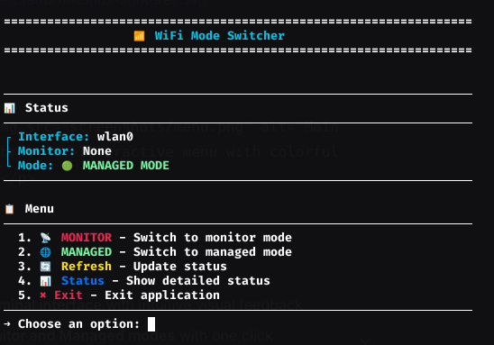

WiFi Mode Switcher 🌐

A beautiful, interactive command-line tool for switching wireless interfaces between Monitor and Managed modes on Linux systems. Perfect for penetration testing, network analysis, and Wi-Fi troubleshooting.

    <em>Interactive menu with colorful terminal output</em> 

✨ Features

    🎨 Beautiful colored terminal interface with intuitive visual feedback

    📡 Switch between Monitor and Managed modes with one click

    🔍 Automatic detection of wireless interfaces

    🧹 Automatic cleanup of duplicate monitor interfaces

    📊 Real-time status display showing current mode and interfaces

    🔄 Refresh and detailed status information

    🛡️ Root privileges handling with proper error messages

    💻 No external dependencies - uses only standard Linux tools

🚀 Quick Start
Prerequisites

    Linux operating system (Ubuntu, Kali, Debian, etc.)

    Python 3.6+

    Root/sudo access

    Wireless adapter that supports monitor mode

Installation
bash

# Clone the repository
git clone https://github.com/Bbobbbbb/restore-network-cli.git
cd restore-network-cli

# Make the script executable
chmod +x restore-network-cli.py

# Run with sudo
sudo ./restore-network-cli.py

One-liner Installation
bash

sudo wget -O /usr/local/bin/wifi-mode-switcher https://raw.githubusercontent.com/Bbobbbbb/restore-network-cli/main/restore-network-cli.py && sudo chmod +x /usr/local/bin/wifi-mode-switcher && sudo wifi-mode-switcher

🎮 Usage

Run the application with root privileges:
bash

sudo python3 restore-network-cli.py

Menu Options
Option	Description	Color
1	Switch to Monitor Mode - Enables packet injection and monitoring	🔴 Red
2	Switch to Managed Mode - Standard Wi-Fi client mode for connecting to networks	🟢 Green
3	Refresh - Update the current status display	🟡 Yellow
4	Detailed Status - Show comprehensive interface information	🔵 Blue
5	Exit - Close the application	⚫ White
📋 What Each Mode Does
📡 Monitor Mode

    Enables packet capture and injection

    Creates a [interface]mon interface

    Useful for:

        Wi-Fi penetration testing

        Network analysis

        Packet sniffing

        Aircrack-ng suite tools

🌐 Managed Mode

    Standard Wi-Fi client mode

    Allows connecting to Wi-Fi networks

    Restarts NetworkManager

    Useful for:

        Normal internet browsing

        Connecting to access points

        Wi-Fi troubleshooting

🔧 Technical Details
Requirements

The script uses the following Linux tools (usually pre-installed):

    ip - Network interface management

    iw - Wireless device configuration

    airmon-ng - Monitor mode management

    nmcli - NetworkManager CLI

    dhclient - DHCP client

How It Works

    Detection: Automatically finds the first wireless interface

    Cleanup: Removes any existing monitor interfaces

    Mode Switch: Configures the interface for the selected mode

    Verification: Confirms the mode change and displays status

Compatible Wireless Chipsets

    Atheros (ath9k, ath5k)

    Ralink (rt73, rt2800)

    Realtek (rtl8187, rtl8188, rtl8812)

    Broadcom (b43, b43legacy)

    Intel (iwlwifi)

🐛 Troubleshooting
Common Issues
Issue	Solution
"No wireless interface found"	Ensure your Wi-Fi adapter is connected and recognized by the system
"Please run as root"	Always use sudo to run the script
Monitor mode not working	Check if your adapter supports monitor mode
NetworkManager not restarting	Try sudo systemctl restart NetworkManager manually
Diagnostic Commands
bash

# Check wireless interfaces
iw dev

# Check interface modes
iw dev wlan0 info

# Check supported modes
iw list | grep "Supported interface modes" -A 8

📁 File Structure
text

restore-network-cli/
├── restore-network-cli.py    # Main application script
├── README.md                 # This documentation
├── LICENSE                   # MIT License
└── screenshots/              # Screenshot images (optional)
    └── menu.png

🤝 Contributing

Contributions are welcome! Here's how you can help:

    Fork the repository

    Create a feature branch

    Commit your changes

    Push to the branch

    Open a Pull Request

Development
bash

# Clone your fork
git clone https://github.com/Bbobbbbb/restore-network-cli.git
cd restore-network-cli

# Make changes and test
python3 restore-network-cli.py

📝 Changelog
v1.0.0 (2024)

    Initial release

    Beautiful terminal interface with colors

    Automatic interface detection

    Support for monitor/managed mode switching

    Interactive menu system

    Detailed status display

📄 License

This project is licensed under the MIT License - see the LICENSE file for details.
⚠️ Disclaimer

This tool is intended for educational purposes and authorized network testing only. Always ensure you have permission to test the networks you are analyzing. The author is not responsible for any misuse of this software.
🙏 Acknowledgments

    Inspired by the need for a simple, visual Wi-Fi mode switcher

    Built using standard Linux networking tools

    Terminal color scheme inspired by modern CLI tools

📞 Support

    Issues: GitHub Issues

    Discussions: GitHub Discussions

 Made with ❤️ for the Linux community 

